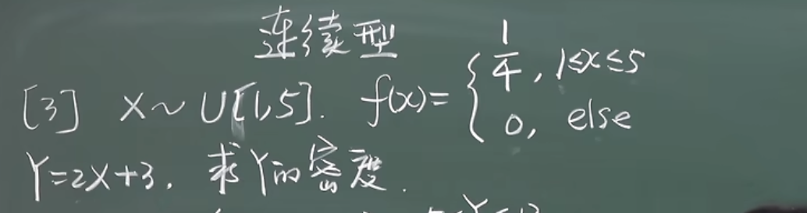
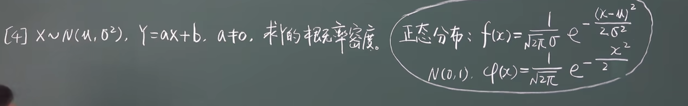
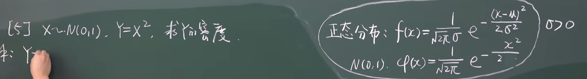

## 随机变量及其分布

### 随机变量的定义
### 分布函数
### 离散型随机变量
### 连续型随机变量

#### 离散型随机变量的分布律
#### 常见的离散型随机变量
##### 0-1分布 
##### 二项分布
##### 泊松分布
##### 几何分布
##### 超几何分布

#### 连续型随机变量的概率函数
#### 常见的连续型随机变量的概率密度函数
##### 均匀分布
定义：如果连续型随机变量X的概率密度函数为： 
$f(x) = \left\{ \begin{array}{ll}
\frac{1}{b - a}, & a \leq x \leq b; \\
0,  & \text{else}
\end{array} \right.$，
那么我们称随机变量 X 服从均匀分布，记作 X~U[a,b]。
其分布函数为：
$$
F(x) = \left\{
\begin{array}{ll}
0, & x < a; \\
\frac{x - a}{b - a}, & a \leq x \leq b; \\
1, & x > b
\end{array}
\right.
$$

TODO：
1.使用两种方法手写演算下随机变量X的密度函数，求随机变量Y=g(X)的分布函数和密度函数:
具体题目：
结论：若 X~U[a,b] Y = cX+d ，则 Y ~ U[ac+d,bc+d]

2.再演算两道例题，强化理解和记忆:
具体题目：

3.这个地方需要好好做下练习题，课本中的练习题和宋浩老师课程中总结的三种方法。

